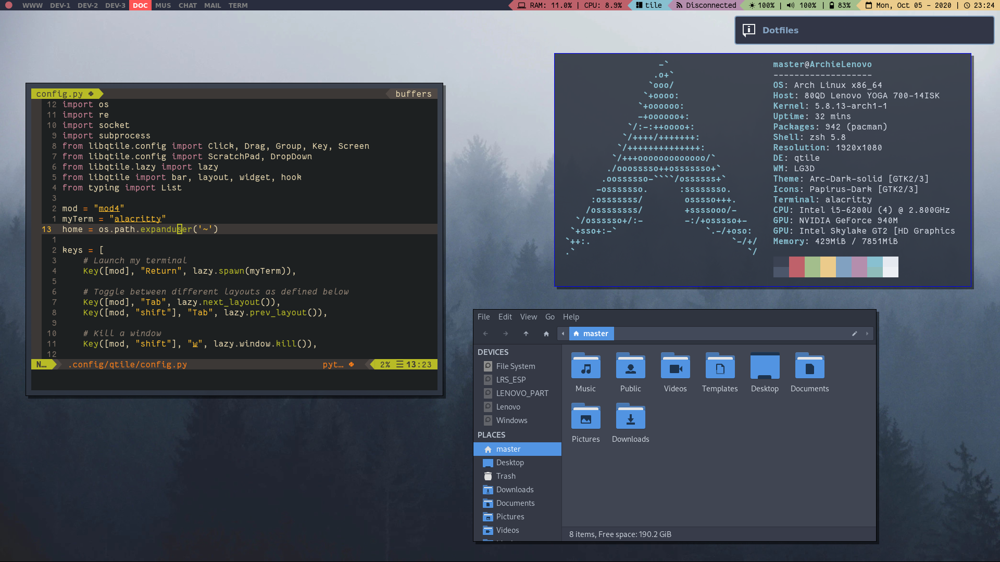

# DotFiles

This are my configuration files. I initially uploaded them here on GitHub in case of an accident, but now I decided to make my repository open to the GitHub community in case any of you had interest in trying my configuration. I spent more than two months writing this files and I'm still improving them. 
This is the result:

 

You will see here the configuration files for:
* Alacritty terminal emulator
* Qtile desktop environment
* Neovim
* Rofi
* Bash
* Zsh
* And some other less important files

### **General Recommendation**
Before trying this files out, there are many points to take into consideration:
* You will see that I use many font families in my config files that in Linux Distros like Arch are not included in the base installation so you may need to install:
  * <code>ttf-fantasque-sans-mono</code>
  * <code>ttf-font-icons</code>
  * <code>ttf-unifont</code>
  * <code>ttf-dejavu</code>
  * <code>ttf-ubuntu-font-family</code>
  
*Font families are listed in relevance and usage order. Many of this fonts are not available in the official package respositories from Arch Linux, so you may need to use the [AUR](https://wiki.archlinux.org/index.php/AUR_helpers). I've been using yay AUR helper since the beginning.*

* To get NeoVim running:
  * You firstly need to install a Plugin Manager. My NeoVim config is prepared for using the [vim-plug](https://github.com/junegunn/vim-plug). To install it on your machine you need to run 
    <pre><code>sh -c 'curl -fLo "${XDG_DATA_HOME:-$HOME/.local/share}"/nvim/site/autoload/plug.vim --create-dirs \
      https://raw.githubusercontent.com/junegunn/vim-plug/master/plug.vim'</code></pre>
  * Then you need to run <code>:PlugInstall</code> within NeoVim after running <code>:w</code> and <code>:source %</code> in the NeoVim config file
* To get Qtile running:
  * There are some Python modules required to get Qtile running that are listed in the [Qtile Documentation](http://docs.qtile.org/en/latest/) which is very well explained. The packages are mentioned in every **widget** section so you may need to explore the documentation to find out which modules are required.
  * Also you may need to install [xmenu](https://github.com/phillbush/xmenu).
* To get Alacritty running you just need to install **Alacritty** from your package manager and the configuration file will be loaded automatically since it's located in the default location.
* To get Bash running you need to install some packages from  your package manager to get every <code>.bashrc</code> feature working:
  * <code>Git</code>
  * <code>exa</code>
  * <code>firefox</code> (this one is optional since I added a command on the <code>.bashrc</code> that needs it just for testing)
* Lastly, to get Rofi running you may need to install [rofi-calc](https://github.com/svenstaro/rofi-calc) from your package manager.

I hope you enjoy it and if you have any suggestion I'd likely hear them :D
